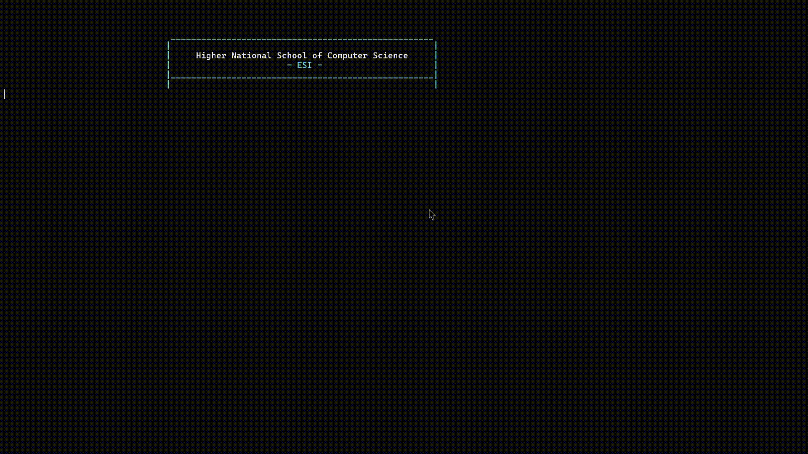

# Occupational-Health-Medical-Visit-Management
This project is the first major assignment for the "Algorithmics and Dynamic Data Structures" module. It consists of a console-based C application designed to automate and manage medical consultations for employees in an industrial company. All functionalities are implemented using core C language, with a strong focus on dynamic data structures.

<div align="center">
  
  [](https://github.com/kalis26/Occupational-Health-Medical-Visit-Management/stargazers)
  [](https://github.com/kalis26/Occupational-Health-Medical-Visit-Management/forks)
  [](https://github.com/kalis26/Occupational-Health-Medical-Visit-Management/issues)
  [](https://github.com/kalis26/Occupational-Health-Medical-Visit-Management/blob/main/LICENSE)
  
</div>

<div align="center">

  
 
</div>

## Core Features
* **Generation of Random Employee Data (Bonus)**

	* Generate random data of a choosen number of employees
 	* Store the data in the `EmpRecords.txt` file. 

* **Employee Records Management**
  
	* Load employee data from `EmpRecords.txt` into a linked list.
	* Add, update, and delete medical records.
  	* Maintain medical history and consultation dates.
 
* **Consultation Scheduling and Management**

	* Read daily consultations from `Consultations.txt`.
	* Build a priority queue based on consultation type:
    
		* *Highest priority*: Work accident.
		* Followed by: Occupational disease.
		* Then: Return-to-work and Pre-employment visits.
		* *Lowest priority*: Periodic examinations.
	* Maintain FIFO order within the same priority.
	* Manage real-time modifications: add, cancel, close, or reschedule consultations.
	* Ensure daily capacity does not exceed 10 appointments.

* **Next-Day Appointment Automation**

	* Automatically schedule return-to-work and annual periodic check-ups for the next day.
 
* **Data Persistence**

	* Update and save all changes back into the EmpRecords.txt and Consultations.txt files at the end of the session.

## Technical Highlights
* Utilizes linked lists, priority queues, and dynamic memory management.
* Modular, well-commented code structured for maintainability and clarity.
* File I/O for data loading and persistent storage.
* Designed to reflect realistic constraints in occupational health services.

## Documentation
* To know more about the project, you can access the instructions folder.

## System Requirements
* Windows terminal
* Standard C libraries

## How to run ?
* First, you need to get the full path of the folder the executable is in.
* Once you have it, opend the Windows terminal "**cmd**" (not as administrator) and execute the following commands:
```
cd "insert_path_here"
```
```
TP.exe
```

## Insights & Recommandations

* The program was written in Visual Studio Code, so I don't know if it will display errors in other IDEs such as CodeBlocks that would prevent compilation. In any case, I've attached the already compiled "TP.exe" file to the folder, which you just need to run.

* To run the program, it's best to change the command prompt settings and set the font to 10 to avoid display problems. Otherwise, the VS Code terminal works fine too.

* If you choose to run the program in the Windows command prompt, please change the working directory to the folder where the TP.exe file is located (See "How to run?" section). Because if you run the file directly in CMD, the files EmpRecords.txt and Consultations.txt will be created in your home directory, instead of the lab folder.

* I've attached the files EmpRecords.txt and Consultations.txt in the folder, but you can delete them, use others, or generate random ones using my program.
